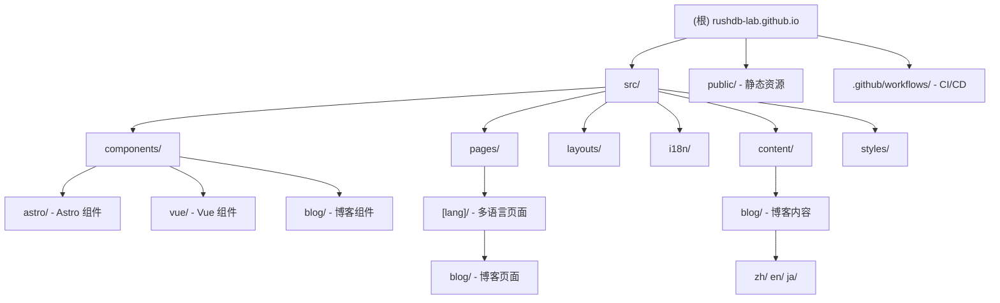

# CLAUDE.md - RushDB Lab 官方网站

> 本文档由 AI 架构师自动生成，用于帮助 AI 助手理解项目结构和开发规范。

## 项目愿景

RushDB Lab 官方网站是一个展示数据库技术竞赛团队成就、项目和成员的多语言静态网站。基于 Astro 5 构建，支持中文、英文、日文三种语言，提供博客系统和 SEO 优化。

## 架构总览

```
技术栈：Astro 5 + Vue 3 + TypeScript
部署方式：GitHub Pages (静态托管)
构建工具：Vite (Astro 内置)
样式方案：原生 CSS + CSS Variables
国际化：Astro 内置 i18n + 自定义翻译系统
```

### 核心特性

- **多语言支持**：zh（中文，默认）、en（英文）、ja（日文）
- **博客系统**：基于 Astro Content Collections，支持 Markdown
- **SEO 优化**：Sitemap、RSS、Open Graph、JSON-LD 结构化数据
- **响应式设计**：移动端优先，支持桌面端和移动端导航

## 模块结构图



## 模块索引

| 模块路径 | 职责 | 语言 | 入口文件 |
|---------|------|------|----------|
| `src/` | 源代码根目录 | TypeScript/Astro/Vue | - |
| `src/pages/` | 页面路由 | Astro | `[lang]/index.astro` |
| `src/components/astro/` | Astro 静态组件 | Astro | 各 Section 组件 |
| `src/components/vue/` | Vue 交互组件 | Vue 3 | `NavBar.vue`, `BackToTop.vue` |
| `src/components/blog/` | 博客专用组件 | Astro | `PostCard.astro` |
| `src/layouts/` | 页面布局 | Astro | `BaseLayout.astro` |
| `src/i18n/` | 国际化系统 | TypeScript | `index.ts`, `ui.ts` |
| `src/content/` | 内容集合 | Markdown | `config.ts` |
| `src/styles/` | 全局样式 | CSS | `global.css`, `site.css` |
| `public/` | 静态资源 | - | 图片、robots.txt |

## 运行与开发

### 环境要求

- Node.js 20+
- npm

### 常用命令

```bash
# 安装依赖
npm install

# 启动开发服务器
npm run dev

# 构建生产版本
npm run build

# 预览构建结果
npm run preview
```

### 目录结构

```
rushdb-lab.github.io/
├── src/
│   ├── components/
│   │   ├── astro/          # Astro 组件（静态渲染）
│   │   │   ├── HeroSection.astro
│   │   │   ├── AchievementsSection.astro
│   │   │   ├── ProjectsSection.astro
│   │   │   ├── MembersSection.astro
│   │   │   ├── NewsSection.astro
│   │   │   ├── ContactSection.astro
│   │   │   └── Footer.astro
│   │   ├── vue/            # Vue 组件（客户端交互）
│   │   │   ├── NavBar.vue
│   │   │   ├── BackToTop.vue
│   │   │   └── AboutSection.vue
│   │   └── blog/           # 博客组件
│   │       ├── PostCard.astro
│   │       ├── TableOfContents.astro
│   │       └── RelatedPosts.astro
│   ├── content/
│   │   ├── config.ts       # 内容集合配置
│   │   └── blog/
│   │       ├── zh/         # 中文博客
│   │       ├── en/         # 英文博客
│   │       └── ja/         # 日文博客
│   ├── i18n/
│   │   ├── index.ts        # i18n 工具函数
│   │   └── ui.ts           # 翻译文本定义
│   ├── layouts/
│   │   └── BaseLayout.astro
│   ├── pages/
│   │   ├── index.astro     # 根路径重定向
│   │   └── [lang]/
│   │       ├── index.astro # 首页
│   │       ├── rss.xml.ts  # RSS 订阅
│   │       └── blog/
│   │           ├── index.astro
│   │           └── [slug].astro
│   └── styles/
│       ├── global.css      # 全局样式（大型）
│       └── site.css        # 站点样式
├── public/                 # 静态资源
├── astro.config.mjs        # Astro 配置
├── tsconfig.json           # TypeScript 配置
├── package.json            # 项目依赖
└── .github/workflows/      # GitHub Actions
```

## 测试策略

当前项目**未配置自动化测试**。建议未来考虑：

- 使用 Playwright 进行 E2E 测试
- 使用 Vitest 进行单元测试（i18n 函数等）

## 编码规范

### TypeScript

- 使用严格模式（`astro/tsconfigs/strict`）
- 路径别名：`@/*` 映射到 `src/*`

### ESLint 配置

- 继承：`eslint:recommended`, `plugin:vue/vue3-essential`, `plugin:@typescript-eslint/recommended`
- 解析器：`vue-eslint-parser` + `@typescript-eslint/parser`

### 样式规范

- 使用 CSS Variables 定义主题色和间距
- 遵循移动端优先的响应式设计
- 主题色变量：`--c1`, `--c2`, `--c3`（渐变色）
- 文本色变量：`--text`, `--text-2`, `--text-3`

### 组件命名

- Astro 组件：PascalCase，后缀 `.astro`
- Vue 组件：PascalCase，后缀 `.vue`
- 页面文件：小写，使用 `[param]` 表示动态路由

## AI 使用指引

### 添加新语言

1. 在 `src/i18n/ui.ts` 中添加新语言的翻译对象
2. 更新 `Lang` 类型定义
3. 在 `astro.config.mjs` 中更新 `i18n.locales`
4. 为博客创建对应语言目录 `src/content/blog/{lang}/`

### 添加新页面

1. 在 `src/pages/[lang]/` 下创建 `.astro` 文件
2. 实现 `getStaticPaths()` 返回所有语言路径
3. 使用 `BaseLayout` 作为布局组件
4. 使用 `getI18n(lang)` 获取翻译函数

### 添加博客文章

1. 在 `src/content/blog/{lang}/` 下创建 `.md` 文件
2. 添加 frontmatter：`title`, `description`, `pubDate`, `category`, `tags`
3. 支持的分类：`database`, `competition`, `tutorial`, `news`, `research`

### 修改导航

- 桌面端/移动端导航在 `src/components/vue/NavBar.vue`
- 导航文本在 `src/i18n/ui.ts` 的 `nav` 对象

## 变更记录 (Changelog)

| 日期 | 版本 | 变更内容 |
|------|------|----------|
| 2026-02-04 | 1.0.0 | 初始文档生成 |
